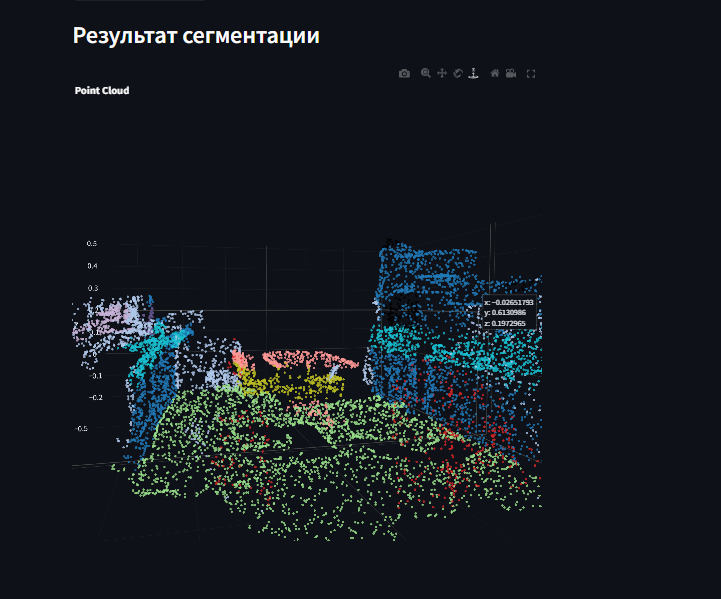

# 3D Semantic Segmentation Toolkit

  
*Semantic segmentation example on ScanNet scene*

## Project Overview

This repository provides a comprehensive framework for training and deploying 3D semantic segmentation models. The implementation supports various neural architectures for ScanNet dataset with different data representational.

## Installation

### Dependencies
```bash
# Python 3.8+
conda create -n 3dseg python=3.8
conda activate 3dseg

# Install core dependencies
pip install -r requirements.txt

# Install PyTorch (select version matching your CUDA)
pip install torch==2.0.1+cu118 torchvision==0.15.2+cu118 -f https://download.pytorch.org/whl/torch_stable.html
```

# Dataset Setup
1.Download sample ScanNet from kaggle https://www.kaggle.com/datasets/dngminhli/scannet
2.Organize data with this structure:
```
datasets/
└── scannet/
    ├── scenes0000_00/
    │   ├── scene0000_00_vh_clean_2.ply (raw points cloud scene)
    |   |── scene0000_00_vh_clean_2.labels.ply (labels points cloud scene)
    |   |── scene0000_00_vh_clean_2.0.010000.segs.json
    |   |── scene0000_00.txt (scene information)
    |   |── scene0000_00.aggregation.json (aggregation per classes)
    |   |──────
    ├── scenes0000_01/
    │   ├── scene0000_01_vh_clean_2.ply
    |   |── scene0000_01_vh_clean_2.labels.ply
    |   |── scene0000_01_vh_clean_2.0.010000.segs.json
    |   |── scene0000_01.txt
    |   |── scene0000_01.aggregation.json
    |   |──────
    ...
```

# Training
```python
python train.py 
```
# Inference
```python
python inference.py \
    inference.input_path=examples/scene.ply \
    model=pointtransformer \
    inference.checkpoint_path=checkpoints/best_model.pth
```
# StreamLit visualization
```python
streamlit run streamlit_app.py
```

# Repository Structure
```
3d-seg-repo/
├── configs/             # configuration
├── data/                # Data modules(dataset, augmentation)
├── models/              # Model implementations
├── utils/               # utils(and losses)
├── evaluation/          # Evaluation metrics
├── inference.py         # Inference script
├── train.py             # Main training script
├── streamlit_app.py     # streamlit_app
├── requirements.txt     # Python dependencies
```
## Supported Models

| Model            | Support Extra Features<br>(RGB, Normals) | mIoU<br>(ScanNet sample) |
|------------------|------------------------------------------|--------------------------|
| PointNet         | ❌                                       | 21.6%                    |
| PointNet++       | ✅                                       | 39.4%                    |
| VoxelNet         | ❌                                       | 19.2%                    |
| VoxelNet+        | ✅                                       | 20.7%                    |
| DGCNN            | ✅                                       | 30.1%                    |
| PVCNN            | ✅                                       | 46.1%                    |

### PVCNN:

@inproceedings{liu2019pvcnn,
  title={Point-Voxel CNN for Efficient 3D Deep Learning},
  author={Liu, Zhijian and Tang, Haotian and Lin, Yujun and Han, Song},
  booktitle={NeurIPS},
  year={2019}
}
